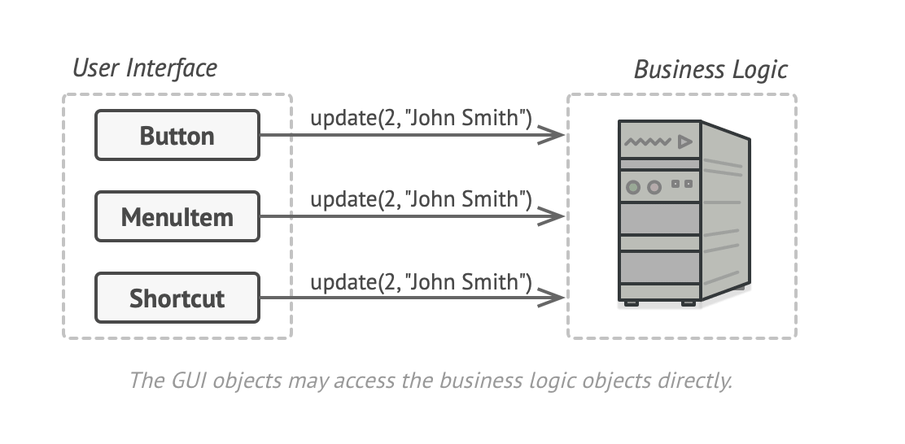
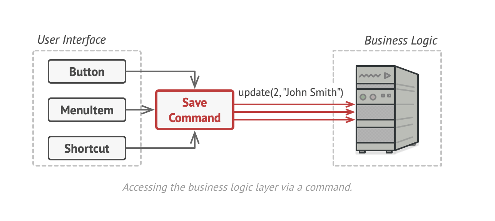

# Command / (Action, Transaction)

## Intent

- Turns a request into a stand-alone object that conatins all the information about the request.
- Lets you pass requests as method args, delay or queue execution, and support undo.

## Problem

- Say you have a button class that needs to have many variants (CancelButton, ApplyButton, SaveButton etc)
- Implementing subclasses eventually gets unwieldy and lots of components will break when `Button` changes

## Solution

- Command pattern suggests that GUI objects hsouldn't send request directly.
- Instead extract the request details such as the object called, name of method and the list of args into a `command` class with a single method.
- Command objects link between GUI and business logic objects

- Then make commands implement the same interface -- Execute method that takes no parameters
- The interface lets you use various commands with the same sender without coupling it a concrete class
- You can also switch command objects at runtime
- How to pass request details to receiver? 
  - Command should be pre-configured with the data.
- Commands become a convenient middle layer that reduces coupling between GUI and business logic layers

## Real World Analogy

- At a restaurant, wait takes the order and the order goes on a piece of paper until the chef is ready to handle it.

## Structure

- Sender: Initiates request
  - Has a field for storing a reference to a command object
  - Sender triggers the command instead of sending the request directly to the receiver
  - Command interface is usually just a single method `execute` for executing a command
  - Concrete Commands implement different kinds of requests. Any parameters required for the method can be declared as fields in the concrete commmand.
    - You can make these immutable by allowing the initialization only via constructor.
  - Receiver class has some business logic
  - Client creates and configures concrete command objects, then passes the request params into the command's constructor. Then the command may be associated with 1+ senders.

## Applicability

- Use the Command pattern to parametrize objects with operations
  - Can turn specific method calls into a stand-alone object
  - Can pass commands as arguments, store them, etc.
- Use when you want to queue operations, schedule or execute them remotely
  - Commands can be serialized, queued and logged
- Use to implement reversible operations
  - Useful for implementing undo/redo
  - Command hisotry is a stack that contains all executed command objects

## How to Implement

1. Declare the command interface w/ a single `execute` method
2. Extract requests into concrete command classes implementing the command interface
3. ID classes to act as `senders` an fields for storing commands into those classes
    - Senders communicate with commands only via the command interface
    - Senders get the commands from the client code
4. Change the senders to execute the command instead of sending request to receiver directly
5. Client should initialize objects in this order:
   1. Create receivers (business logic)
   2. Create commands, associate them w/ receivers
   3. Create senders, associate them w/ specific commands

## Pros and Cons

### Pros

- Single Responsibility: Decouple classes that invoke ops from classes that perform the ops.
- Open/Closed: Introduce new commands w/o breaking existing client code
- Can implement deferred execution, undo/redo, assemble sets of simple commands into complex ones.

### Cons

- Code may become more complicated from adding a new layer between senders and receivers.

## Usage Examples

- Used often as an alternative for callbacks to parameterize UI elements with actions

## Identification

- Recognizable by behavioralmethods in an interface type (sender) which invoke a method in a different interface (receiver) that has been encapsulated by the command implementation.
- Command classes usually limited.