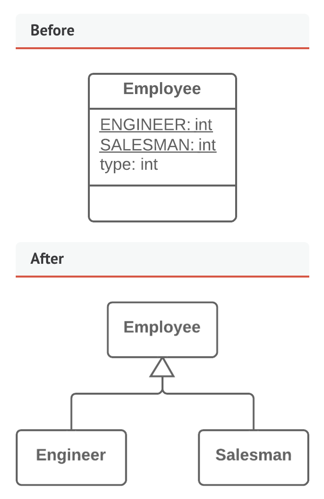

# Code Smells: Object-Oriented Abusers - Switch Statements

- Signs and symptoms: Complex `switch` operators or a sequence of `if` statements

- Reasons for the problem:
  - Object oriented code should make `switch` and `case` operators rare. Code for a single switch can be scattered in different places
  - When we see `switch` we should think of polymorphism

- Treatment:
  - To isolate switch and put it in the right class, Extract it and Move it.
    - Extract: Move code to a separate new method or function
    - Move: If a method is used more in another class, move that method over there and reference the other class instead. Move the method to a class that contains most of the data used by the method.
  
  - If switch is based on type, Rebplace type with subclasses or Replce type with state/strategy
    - Replace type with sublcasses
      - 
      - This allows us to delete the control flow code. Instead of bulky `switch` or `if` sttements it moves the code to appropriate subclasses.
      - If we need to add a new value for a coded type we can just add a new subclass instead.
    - Replace Type with State/Strategy
      - Replace type code with a state object
      - Create a class for the type code and declare subclasses for each value of the class
  - After specifiying the inheritance, replace conditional with polymorphism
    - Conditional that performs various actions depending on object type or properties?
      - Create subclasses matching the branches of the conditional
      - In the subclasses, create a share method and move code from the branch of the conditional to it
      - Then we replace the conditional with the method call

```ts
abstract class Bird {
  // ...
  abstract getSpeed(): number;
}

class European extends Bird {
  getSpeed(): number {
    return getBaseSpeed();
  }
}
class African extends Bird {
  getSpeed(): number {
    return getBaseSpeed() - getLoadFactor() * numberOfCoconuts;
  }
}
class NorwegianBlue extends Bird {
  getSpeed(): number {
    return (isNailed) ? 0 : getBaseSpeed(voltage);
  }
}

// Somewhere in client code
let speed = bird.getSpeed();
```

- We can also break the method into multiple smaller methods by Replacing Parameter with Explicit Methods
  - A method should get split into parts which is run depending on a valjue of a parameter. Don't use this if the method is rarely changed or hdoesn't have many variants.
- If one of the conditionals is null, introduce a null object

```ts
class NullCustomer extends Customer {
  isNull(): boolean {
    return true;
  }
  getPlan(): Plan {
    return new NullPlan();
  }
  // Some other NULL functionality.
}

// Replace null values with Null-object.
let customer = (order.customer != null) ?
  order.customer : new NullCustomer();

// Use Null-object as if it's normal subclass.
plan = customer.getPlan();
```
- The null object can handle its own type checks and etc.