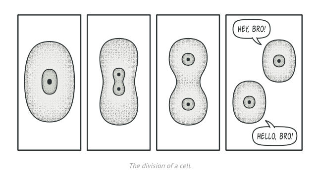

# Prototype

- A design pattern that lets you copy existing objects without making your code dependent on their classes

## Problem

- How to make an exact copy? 
  - Create a new object of same class, then copy all fields of the OG object and copy values over
  - However, we can't copy private fields
  - You have to know the class to create a dup so the code becomes dependent on that class.

## Solution

- Delegate the cloning process to the actual objects being cloned
- Pattern declares a common interface for objects that support cloning
- Allows you to clone objects without coupling code to that class

- Usually the interface just has a single `clone` method
- The `clone` method creates an obj of the current class and carries over all the fields, including private fields

- An object that supports cloning is called a `prototype`
- Cloning objects may serve as an alternative to subclassing
  - We can create a set of objects with different configurations. When we need a configured object, clone a prototype instead of constructing a new one from scratch.

## Real-World Analogy

- Mitosis!

## Structure

1. Prototype interface declares cloning methods
2. Concrete Prototype implements the cloning method, can also handle edge cases
3. Client produces a copy of any object that follows the interface

- You can also implement a prototype registry to provide an easy way to access frequently used prototypes. Has prebuilt objects that are ready to be copied.

## Applicability

- Use the pattern when the code shouldn't depend on the concrete classes of objects needed to copy
  - Makes the client code independent from the classes of the objects it clones
- Use the pattern to reduce the # of subclasses that only differ in how objects are initialized
  - Allows you to use a set of pre-built configured objects as prototypes instead of instantiating subclasses