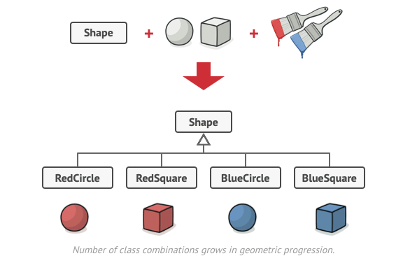
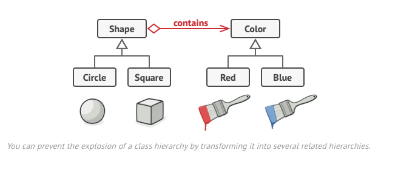
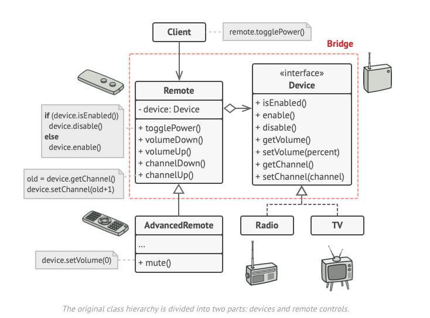

# Bridge

## Intent

- A structural design pattern that lets you split a large class or a set of closely related classes into 2 separate hierarchies - abstraction and implementation
- Each can be developed independantly of each other.

## Problem

- You have a `Shape` class with a pair of subclasses: `Circle` and `Square`
- Now we want to add colors
- However since we already have 2 subclasses we need to create 4 class combos

- Adding new shape types and colors causes the hierarchy to grow exponentially.

## Solution

- We are trying to extend the shape class in 2 independant dimensions: Form and Color
- Bridge pattern solves this by switching from inheritance to the object composition
- We extract one of the dimensions into a separate class hierarchy, so that the original classes ref an object of the new hierarchy insterad of having all behaviors in one class.

- Abstraction and Implementation
- Abstraction (Interface) - Higher level control for some entity. Isn't supposed to do work on its own
- Delegates work to the Implementation (platform) layer
- Example: GUI vs Operating System API's
- Abstraction object: Controls apearance of the app
- Delegates work to the linked Implementation object
- Can change GUI classes without touching the API-related classes.

## Structure

- Abstraction: High level control logic. Relies on Implementation object to do work.
- Implementation: Delcares interface common for all concrete implementations
- Concrete Implementations: Contain platform specific code. Inherit off the Implementations.
- Refined Abstracts: Variants of control logic. Also work with different implementations
- Client: The client's job is to link the abstraction object with one of thei mplementation objects.

## Pseudocode

- Abstraction defines the interface for the ocntrol part of the two class hierarchies.
- Has a reference to an object of the Implementation class type and delegates work to this object.
- You can extend classes from the abstraction independently from device classes.
- Implementation interface declares methods for all implementation classes. Doesn't have to match the abstraction interface.
- Usually provides on primitive operations
- Abstraction has higher level operations based on the primitives.
- All implementation variants follow the implementation interface.

## Applicability

- Use Bridge when you want to divide and organize a monolithic class that includes variants of some functionality.
- Allows you to split the class into several class hierarchies
  - After this, you can change the classes in each hierarchy independly of the classes in the others.
- Use when you need to extend a class in several independent dimensions.
- Use Bridge if you need to be able to switch implementations at runtime.

## How to Implement

1. Identifty orthogonal dimensions
2. See what operations the client needs. Define them in the base abstraction class
3. Determine operations available on all platforms. Declare the ones the abstraction needs in the general implementation interface
4. Create concreate implementation classes following the same implementation interface
5. Reference the implemtnation type inside the abstract class. The abstraction delegates work to the implementation object.
6. If there are several variants, create refined abstractions by extending the base abstraction
7. Client should pass an implementation object to the abstract's constructor to associate one with the other. After that, client can work with only the abstractin object.

## Pros and Cons

- Pros:
  - Create platform independent classes and apps
  - Code works with high level abstractions
  - Open/Closed: Introduce new abstractions independently from each other
  - Single Responsibility: Focus on high level logic in the abstraction and on platform details in the implementation.