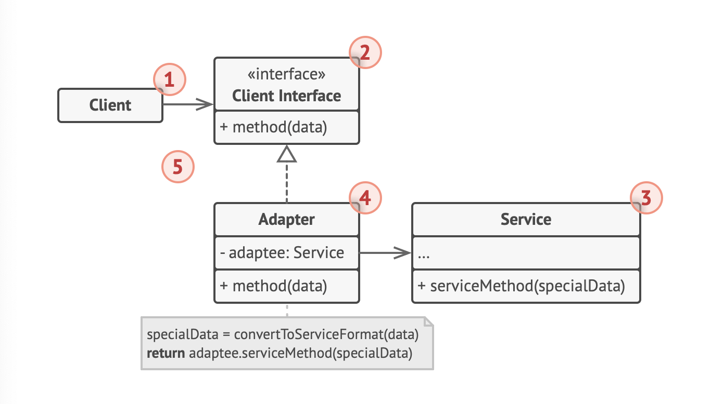
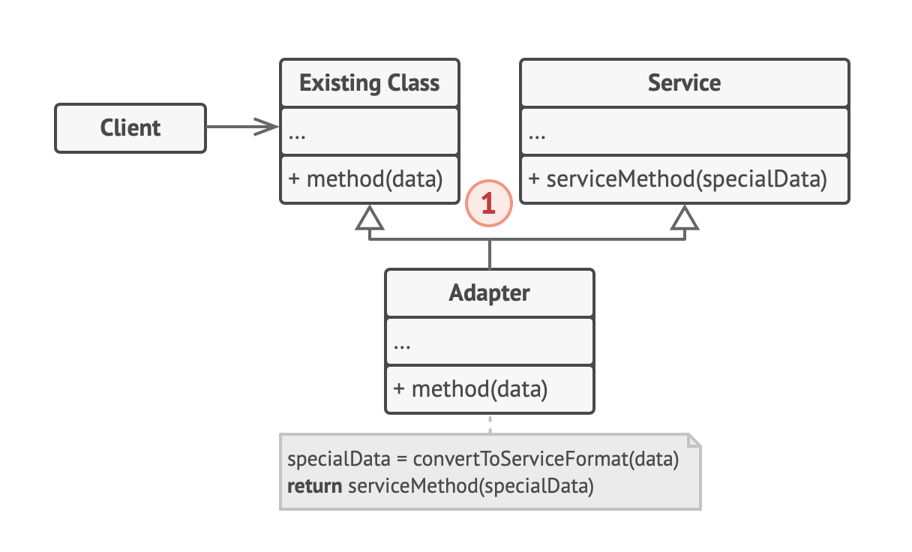

# Adapter Pattern (Wrapper)

## Intent
- Allows objects with incompatible interfaces to collaborate

## Problem
- Your app works with one format but you're using a library that takes another format

## Solution
- Create an adapter - object that convets the interface of one to another so that the other can understand
- The adapter wraps one of the objects to hide the complexity of conversion
- The wrapped object isn't aware of the adapter
- Can help convert data into various formats, or help objects with diff interfaces collaborate
  1. Adapter gets an interface compatible with one of the existing objects
  2. Using this interface, the existing object can safely call the adater's methods
  3. On receiving the call, adapter passes the request to a second object in a format that is expected.

## Real-World Analogy

- US to UK Power adapters

## Structure

### Object Adapter
- Using the object composition principle
- 1 aadapter implements the interface of one object and wraps the other one

- Adapter implements the Client Interface while wrapping the service object. The adapter gets calls from the client nad translates them into calls to the wrapped service object.

### Class Adapter

- Uses inheritance: Adapter inherits interfaces from both objects at the same time
- The language MUST support multiple inheritance.

- The Class adapter doesn't need to wrap objects because it inherits behaviors from both client and service
- The adaptation happens within the overriden methods.

## Applicability

- User the adapter when you want to use an existing class but the interface isn't compatible with the rest of the code
  - Adapter allows you to create a middle layer class that services as a translator.
- Use the pattern when you want to reuse several existing subclasses that lack some common functionality
  - Put missing functionality into an adapter class, then wrap objects with missing features inside the adapter, gaining needed features
  - Target classes must have a common interface.
  - Similar to the Decorator Pattern.

## How to Implement

- Have 2 classes with incompatible interfaces
  - Service class
  - Client class
- Declare client interface and describe how clients communicate with service
- Create adapter class and make it follow the client interface
- Add a field to the adapter to store a reference to the service object
  - Common: use constructor
- Impelment all methods of client interface in the adapter class
- Use the adapter via the client interface