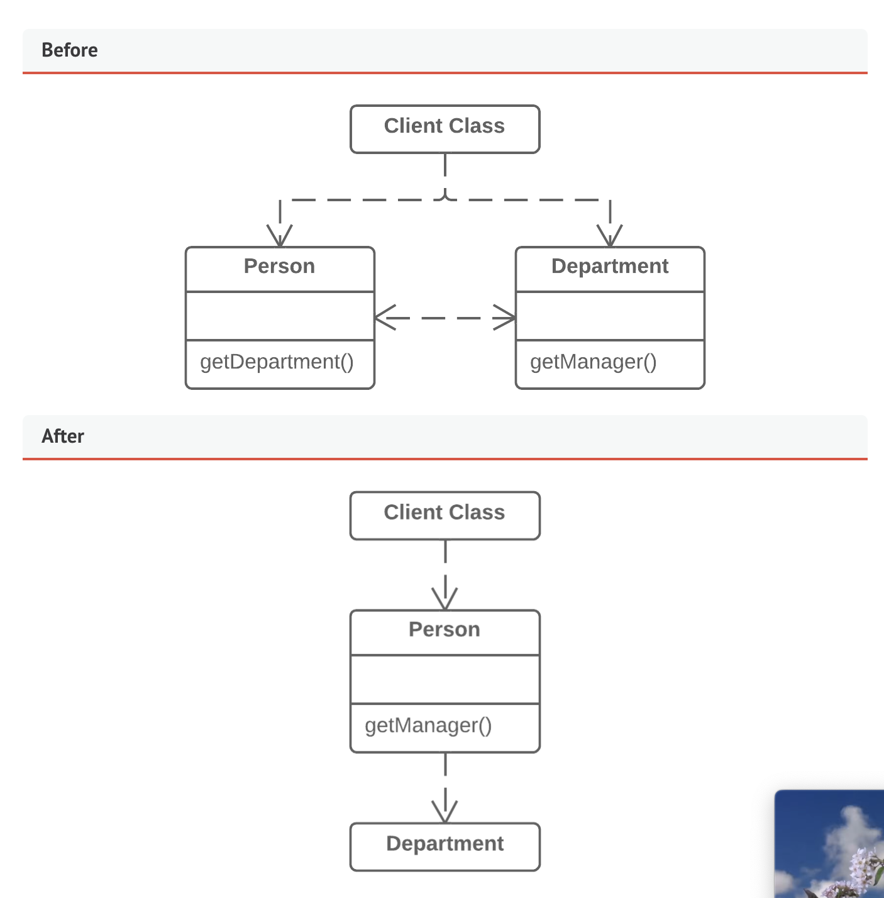

# Hide Delegate

## Problem
- We get object B from a field/method of object A. Then the client calls a method of object B.

## Solution
- Crete a new method in class A that delegates the call to object B. Now we don't need to know about or depend on class B.

## Why Refactor

- Server: Object to which the client has direct access
- Delegate: End object that contains functionality needed by a client

- Call Chains appear when a client requests an object from another object, then the second one requests another one, etc. They involve the client in navigation along the class structure
- This means any changes in the relationships require changes on the client side.

## Benefits

- Hides delegation from the client, makes it easier to make changes to your program if the client needs to know less about the details of relationships between objects

## Drawbacks

- If you need to create a lot of delegating methods, you may risk creating a lot of unnecessary middle men.

## How to Refactor

1. For each method of the delegate class called by the client, create a method in the server class that delegates the call to the delegate class
2. If your changes free the client from needing the delegate class, you can remove the acces smethod to the delegate class.