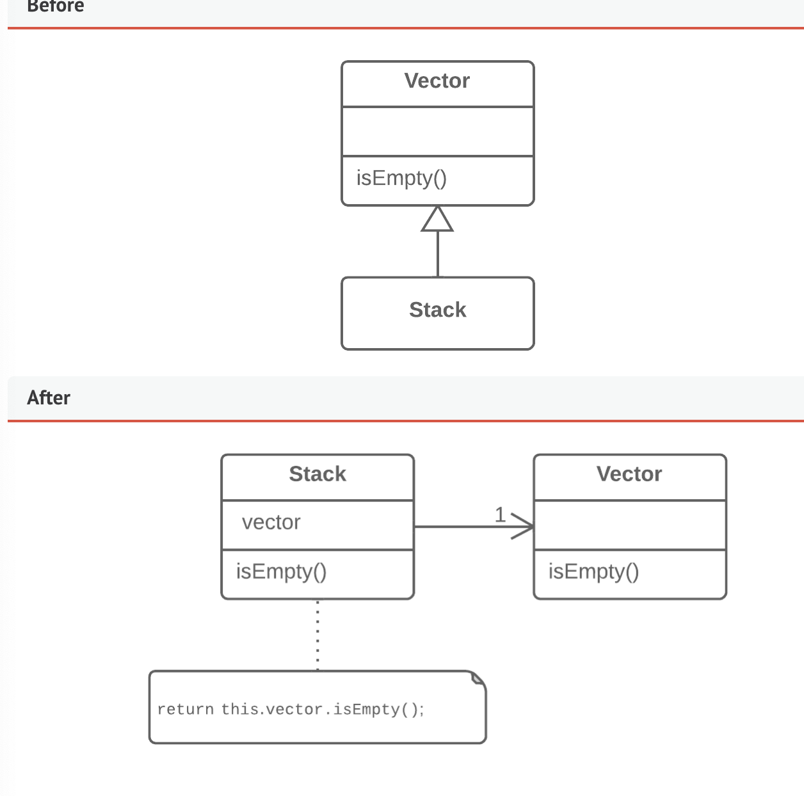

# Replace Inheritance with Delegation

- Problem: Subclass uses only a portion of the methods of its parent class (or it is not possible to inherit superclass data)

- Solution: Create a field and put the parent object in it. Dleegate methods to the superclass object and get rid of the inheritance.

- Why refactor?
  - If subclass violates Liskov Substitution Principle (inheritance implemented only to combine common code, not because the subclass is an extension of the superclass)
  - Subclass uses only a portion of the methods of the superclass

- How to refactor
  - Add a field in the subclass that holds the superclass. Place the object into it
  - Change the subclass methods to use that object instead of `thi`
  - For methods inherited from the superclass, create delegation methods in the subclass
  - Remove the inheritace
  - Move the initialization of the superclass object to the constructor