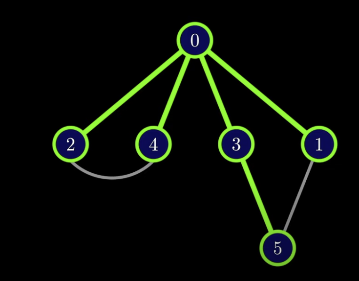

# Breadth First Search (BFS)

## Problem statement
- You're given a graph with a starting node
- How to find the shortest path from that path to every other node in the graph?

## Visualization
- Imagine the graph as nodes attached by loose strings
- If you were to pull the starting node up all nodes would form a tree and then it would be simple to see how to quickly traverse all nodes.

## Intuition
- Starting from a node, we visit next vertex, then visit all of the next distance length unil we visit all

## BFS Implementation

1. Hold a boolean list of the size of the graph to keep track of which we've visited. Set all to False.
2. Use a queue to keep track of vertexes that need to be visited with the starting value as the first element in the queue.
3. While there are things in the queue:
   1. Remove the vertex from front of queue
   2. If not visited, visit the vertex and mark True on our list.
   3. For all unmarked neighbors, add them to our queue.

## Flood Fill Problem

### Q: Given an image represented by a grid of pixel values, a starting pixel, nd a new pixel value, transform all pixels connected to the starting pixel to a new pixel value.

- Keyword: Transforming many connected nodes ---> Graph problem!
- We can transform pixels one by one using a BFS algorithm
  
## Time Complexity

- Best Case: O(V + E)
  - Occurs when target node found after only exploring a few edges and vertices
  - Algorithm may terminate early without having to visit all
  - O(V+E) : V is the # of vertices, E is the number of edges
  
- Average Case: O(V+E)
  - Complexity is the same - linear time complexity proportional to sum of vertices and edges

- Worst Case: O(V+E)
  - The same.

## Space Complexity

- O(V) where V is the number of vertices in the graph
- Typically we use a queue to keep track of the vertices which will be O(V).