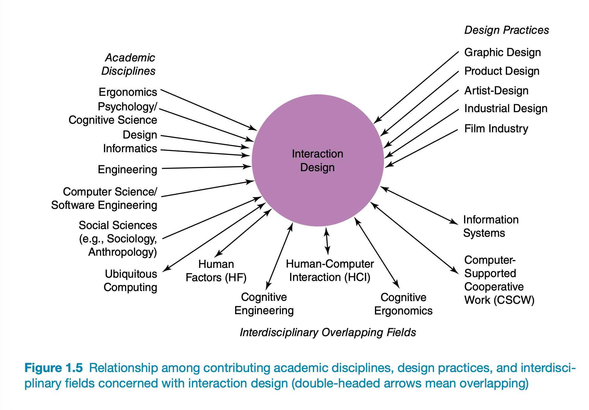
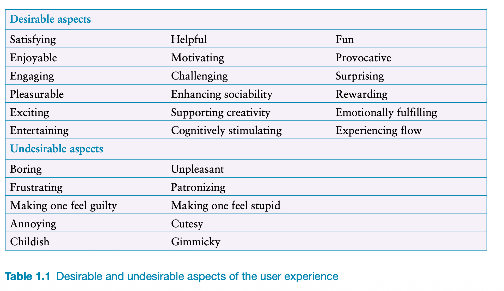

# 1 - What Is Interaction Design?

## 1.1 Introduction

- There is a difference between products designed with users in mind and software systems that perform set functions.
- Many interfaces don't adhere to principles that were already validated in the 90's

## 1.2 Good and Poor Design

- Voicemail system vs. Marble answering machine (1995 design concept)
- Marble answering machine: designed system that represents functionality in behavior of everyday objects
  - marble: Picking up and putting down in another place
- Remote control: TiVo controls designed to fit well into palm of hand, playful, sparing in the # of buttons
- Resist buttonitis: buttons "breeding like rabbits"
- What to design: Consider who is going to use the product, how it is going to be used, and where
- How to optimize user's interactions to support the activities?
  - Could use intuition, or could be based on understanding of users
  - Consider: What are people good and bad at? What might help? What might provide goot UX?
  - Listen to what people want and get them involved using user-centered techniques

## 1.3 What is Interaction Design?

- Designing interactive products to support the way people communicate and interact in their everyday lives
- Overlapping disclipines:

- Multidisciplinary teams best for interaction design
- Interaction design consultancies now exist: Nielsen Norman Group, IDEO

## 1.4 The User Experience

- Refers to: how a product behaves and is used by people in the real world
- You can't design a user experience, only design FOR a user experience
- Can only create the design features that evoke an experience
- Aspects of user experience: Usaility, Functionality, Aesthetics, Content, Look and Feel, Emotional Appeal

## 1.5 Understanding Users

- Learning more about people and what they do can reveal incorrect assumptions about design & how to design for capabilities. Ex: older adults don't necessarily just want all controls to be bigger - they also don't want to learn new technology
- Cultural differences eg: dates

## 1.6 Accessibility and Inclusiveness

- Being fair, open, and equal to everyone. Designing for disabilities and complex mixes of people and capabilities

## 1.7 Usability and UX Goals

- Part of process is to be clear about primary objective of developing an interactive product for users
- Classify objectives in terms of usability and UX goals
- Usability goals: Concened with specific usability criteria (efficiency)
- UX Goals: Concerned with nature of user experience (aesthetically pleasing)

### 1.7.1 Usability Goals

- 6 Usability Goals:
  - Effective
  - Efficient
  - Safe
  - Utility
  - Learnability
  - Memorability

- Performance (effective, effecient), Foundation (Safe, utility), Mind (learnability, memorability)

- Effectiveness: How good a product is at doing what it was supposed to do
  - Q: Is the product capable of allowing people to do X, Y, Z?
- Efficiency: The way the product supports users in carrying out tasks
  - Q: Once users have learned how to use the product, can they sustain a high level of productivity?
- Safety: Protecting the user from dangerous conditions and undesirable situations
  - Q: What is the range of errors possible using the product and what measures are there to permit users to recover from them?
- Utility: Does the product provide the right kind of functionality so that users can do what they need/want to do?
  - Q: Can users carry out all of their tasks the way they'd like to with the product?
- Learnability: How easy a system is to learn and use
  - Q: Is it possible for user to figure out how to use by exploring interface? How hard is it to learn all functions this way?
- Memorability: How easy product is to remember once learned
  - Q: What types of support provided to help users remember how to carry out tasks? Especially for operations that are used infrequently?

### 1.7.2 UX Goals

